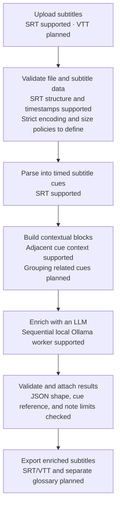

# Subinjector

Subinjector is a personal project exploring an AI-assisted way to learn languages from subtitles. The planned experience will help learners understand vocabulary, idioms, and grammar in context.

## Status

**Early development.** The application accepts an SRT upload, saves its parsed cues and enrichment job in PostgreSQL, then enriches cues sequentially with the configured local Ollama model. Upload returns a job ID; clients can poll job progress and retrieve cue results. VTT support, contextual cue grouping, and subtitle/glossary exports are not implemented yet.

## Intended subtitle-learning flow

The diagram shows the product direction. Labels indicate what exists today and what remains planned; each future step will be specified and implemented incrementally.



Today, upload returns `202 Accepted` with document and job IDs. Poll the job endpoint for progress, then retrieve ordered cue outcomes from the results endpoint. The later export step will produce downloadable subtitle and glossary files.

## Development goals

- Demonstrate modern Kotlin, Java, and Spring Boot backend engineering.
- Learn practical AI engineering, testing, and reliable system design as the project needs them.
- Keep the code understandable and build the portfolio project through small increments.

## Development workflow

Work in short iterations: record a consequential product or architecture decision when one is actually made, write a small feature specification, implement one reviewable slice, run focused tests and verification, review the change for understanding, then commit it on a branch and submit it through a pull request. Add a learning note only when there is a concrete lesson from the work.

AI assistance should stay within one small implementation slice at a time. The project owner reviews the result before work moves to the next slice. ADRs capture real decisions; they are not a place for speculative future choices. See [the AI contribution guide](CONTRIBUTING_AI.md) for the branch naming convention, and see [the specification guide](docs/specs/README.md), [ADR guide](docs/adr/README.md), and [learning notes guide](docs/learnings/README.md).

## Requirements

- Java 21 (LTS)

The Gradle wrapper is included, so a separate Gradle installation is not required.

## Local development

The application and Spring Boot integration tests expect PostgreSQL on port `5432`. Start the local database before building, testing, or running the application. Flyway applies pending migrations at application startup.

```bash
docker compose up -d --wait postgres
./gradlew build
./gradlew test
./gradlew bootRun
```

Stop PostgreSQL with `docker compose down`. The named volume preserves local data between runs. To remove the volume and recreate an empty database, use `docker compose down --volumes`.

The Compose file uses local development credentials. Set `DATABASE_PASSWORD` in your shell or a local `.env` file to override the password; do not reuse the default outside local development.

The Gradle wrapper is included, so a separate Gradle installation is not required. Java 21 (LTS) is required. Windows users can use `gradlew.bat` for Gradle commands.

The foundation exposes one introductory endpoint:

```bash
curl http://localhost:8080/api/hello
# {"message":"Hello, world!"}
```

Subtitle enrichment is asynchronous. Upload an SRT with the selected learning language and CEFR level:

```bash
curl -i -F 'file=@lesson.srt' -F 'learningLanguage=GERMAN' -F 'learnerLevel=B1' \
  http://localhost:8080/api/subtitles/upload
```

Use the returned `jobId` with `GET /api/enrichment-jobs/{jobId}` to check progress and `GET /api/enrichment-jobs/{jobId}/results` to retrieve available cue outcomes. A later run can reuse stored cues through `POST /api/subtitle-documents/{documentId}/enrichment-jobs` with the same language and level form parameters.

Features will be added incrementally, with requirements and design decisions documented as they are established.
