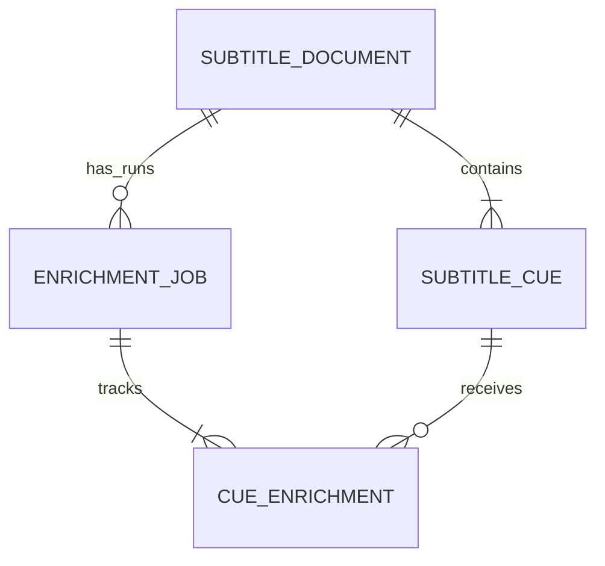

# Feature: Database-backed subtitle enrichment jobs

## Goal

Persist an uploaded subtitle source once, then support one or more durable enrichment runs against its parsed cues. Process each run sequentially so it can outlive the upload request and preserve each cue's outcome.

## Data model decision

- A **subtitle document** represents an uploaded source and owns its parsed cues. It stores source-file metadata; retaining the original file bytes is still an open question.
- A **subtitle cue** belongs to one document and stores its sequence number, timing, and original text. Its sequence number is unique within that document.
- An **enrichment job** represents one requested run for one document, learning language, and learner level. Its UUID identifies that run; job status and timestamps describe its lifecycle.
- A **cue enrichment** associates one job with one source cue and stores that cue's processing status and validated result. A job has at most one cue-enrichment record for each cue.
- One document can have multiple enrichment jobs. A new language or CEFR level creates a new job and new cue-enrichment records while reusing the existing document and cues.

The relationships are:

## Scope

- Persist document metadata and its parsed subtitle cues in PostgreSQL.
- Create a separate enrichment job for each requested language and CEFR level.
- Persist one cue-enrichment record per job and source cue.
- Use a single sequential worker that polls PostgreSQL for pending cue-enrichment work; PostgreSQL is the initial work queue.
- Persist each cue's successful or skipped outcome as it completes, and mark the job complete when all its cues have terminal outcomes.
- Reuse a document's parsed cues for another enrichment job instead of uploading and parsing the same source again.
- Use Flyway migrations for schema changes. Add a new migration for this model; do not change the already-added V1 migration.

## Out of scope

- Parallel cue processing or multiple worker instances.
- A message broker, webhook callbacks, or a distributed workflow engine.
- Automatic retries of language-model or enrichment-validation failures.
- User accounts, collaboration, or long-term subtitle-library management.
- Translating subtitles or generating a rewritten SRT file.
- Deciding whether and where to retain the original uploaded file bytes.

## Requirements

- PostgreSQL is the persistence engine and Flyway owns schema migrations, as recorded in [ADR-005](../adr/ADR-005-postgresql-and-flyway.md).
- Follow the document, cue, job, and cue-enrichment relationships recorded in [ADR-006](../adr/ADR-006-subtitle-documents-and-enrichment-runs.md).
- Store the learning language and learner level once on the enrichment job because they apply to the whole run. A cue result can obtain them through its job relationship.
- Ensure a cue-enrichment record cannot associate a cue from one document with a job for another document.
- Claim and update work in short database transactions. Call the language model outside database transactions so a slow model request does not hold database locks or a connection.
- Process a job's cue-enrichment records in source sequence order, providing neighboring source cues as context when enriching each cue.
- On a per-cue language-model or enrichment-validation failure, mark that cue skipped and continue with the next cue.
- Validate the model response before storing an enrichment result.
- Do not log full subtitle text, prompts, or generated explanations.
- Provide a Docker Compose configuration and documented commands to run and stop PostgreSQL locally for development.

## Acceptance criteria

- An uploaded subtitle is represented by one durable document and its ordered parsed cues.
- A request to enrich that document creates a job for the selected language and learner level and one pending cue-enrichment record per source cue.
- A later enrichment job for a different level or language reuses the same document and cue records while keeping its outcomes separate.
- The worker processes pending cue-enrichment records sequentially and records each result against both its job and source cue.
- A failed cue is recorded as skipped and does not prevent subsequent cues from being processed.
- A job is marked complete after all of its cue-enrichment records have terminal outcomes.
- Processing records each cue outcome so a process restart does not erase already completed work.
- Database schema creation and evolution use checked-in Flyway migrations, with the new model introduced after V1.
- Automated tests verify persistence and job behavior without making live LLM calls or depending on a developer's local database contents.

## Testing notes

- Use deterministic language-model test doubles.
- Test that multiple enrichment jobs can reference the same document cues and keep their results separate.
- Test that a job cannot be associated with another document's cues.
- Test that cue processing follows document sequence and that a skipped cue does not stop the job.
- Choose an isolated PostgreSQL test strategy before implementation.

## Decisions made for this implementation

- Job statuses are `QUEUED`, `PROCESSING`, and `COMPLETED`; cue statuses are `PENDING`, `PROCESSING`, `SUCCEEDED`, and `SKIPPED`. A model or response-validation failure skips that cue. Unexpected infrastructure failures stop the current worker pass and leave durable work for recovery.
- Upload returns `202 Accepted` with document and job IDs. Clients poll `GET /api/enrichment-jobs/{jobId}` for progress and use `GET /api/enrichment-jobs/{jobId}/results` for ordered cue outcomes.
- Results are available while processing; pending and processing cue records have no enrichment result yet.
- On startup, interrupted `PROCESSING` cues are returned to `PENDING`, and their jobs are returned to `QUEUED`. This is at-least-once processing: a restart between generation and result persistence may cause the model call to be repeated.
- Each request creates a new job, including repeated requests for the same document, language, and learner level. Result reuse or caching is deferred until a requirement justifies it.
- Automated integration tests use the configured PostgreSQL database and unique test documents, so they do not depend on or delete developer data.

## Open questions

- Which document metadata should be retained, and should the original uploaded file bytes be stored so a future parser can reprocess them?
